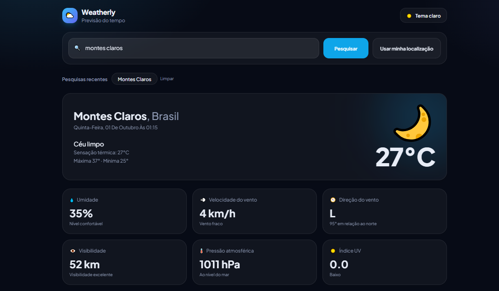
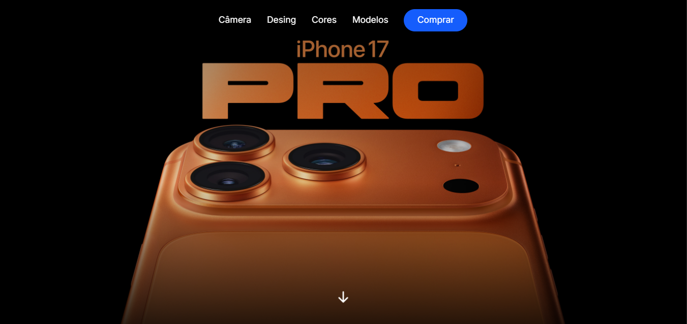

 

<table align="center">
<tr>
<td width="60%" valign="top">

### 👨‍💻 About me

I'm a front-end developer in training who enjoys turning ideas into interfaces that are practical, responsive and enjoyable to use.

I'm currently completing a **Technical Program in Systems Development at Proz Educação**, with expected completion in **December 2026**.

During my studies, I've been building projects with **React, TypeScript, JavaScript, Tailwind CSS and APIs**, while also exploring mobile development with **React Native and Expo**.

I believe the best way to learn is by building. Each project I create is an opportunity to improve my code, understand new concepts and pay more attention to the details that make an interface better.

**I'm currently looking for my first internship or junior front-end opportunity**, where I can contribute, learn from experienced developers and continue growing professionally.

</td>

<td width="40%" align="center">

</td>
</tr>
</table>

---

## 🚀 Featured Projects

<table align="center">
<tr>

<td align="center" width="33%" valign="top">

 

<strong>🌦️ Weatherly</strong>

 

React · TypeScript · Tailwind CSS · API

  

Weather dashboard powered by the Open-Meteo API, featuring city search, current conditions, hourly forecast, 7-day forecast, temperature charts and recent searches.

  

<a href="https://fabioalx29.github.io/Projeto-Clima-/">
<strong>Live Demo →</strong>
</a>

</td>

<td align="center" width="33%" valign="top">

 

<strong>📱 iPhone 17 Pro</strong>

 

React · Tail
